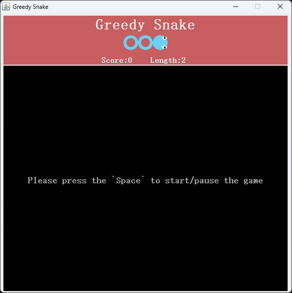

# greedy-snake-java

[README](README.md) | [中文文档](README_zh.md)

## What's greedy-snake-java
- This is a greedy snake game implemented in Java.
- Version of JDK is 1.8
- Developing Based on Java GUI, used the package of Swing/AWT

## Quick Start
- Please ensure that the JVM environment is installed properly before starting
- Download the jar file what name is `greedy-snake-java-xxx.jar` from [Release](https://github.com/DongyangHu/greedy-snake-java/releases)
- run the command `java -jar greedy-snake-java-xxx.jar` to start game.

## Introduction to functions
- The basic logic of Greedy Snake Game. Basic view generation and movement rules
- Scoreboard. Simple scoreboard functionality displaying the current score and length
- Multiple Level Foods. Foods of different levels are generated based on probabilities, with higher-scoring foods having lower probabilities. An expiration policy for foods is added, where higher-scoring foods have shorter lifespans
- Dynamic Difficulty Control. As the score increases, the snake's movement speed accelerates, making the game progressively more challenging
- Game Start/Pause Capability

## LICENSE
[greedy-snake-java](https://github.com/DongyangHu/greedy-snake-java) is licensed under [Apache-2.0](LICENSE)

