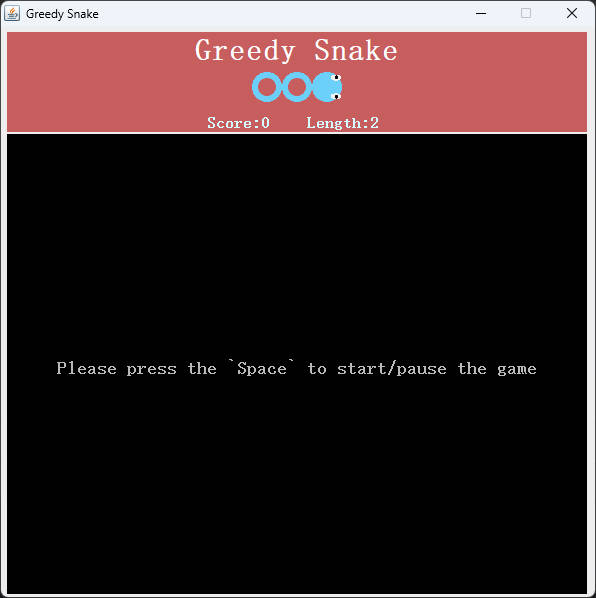

# greedy-snake-java

[README](README.md) | [中文文档](README_zh.md)

## 关于greedy-snake-java
- 这是一个Java语言实现的贪吃蛇游戏
- 使用JDK1.8版本开发
- 基于Java GUI, 使用Swing/AWT包

## 快速开始
- 在开始前，请确保已经正确安装JVM环境
- 从 [Release](https://github.com/DongyangHu/greedy-snake-java/releases) 下载 `greedy-snake-java-xxx.jar` 文件
- 命令行执行 `java -jar greedy-snake-java-xxx.jar`开始游戏

## Introduction to functions
- 贪吃蛇基本逻辑。基本的画面生成以及移动规则
- 计分板。简单的计分板功能，展示当前得分和长度
- 多种等级食物。各等级食物按概率生成，计分越高的食物，概率越低。添加食物过期策略，计分越高的食物，存在时间越短
- 难度动态控制。随分数的增加蛇的移动速度越快，难度越大
- 游戏开始/暂停能力

## LICENSE
[greedy-snake-java](https://github.com/DongyangHu/greedy-snake-java) is licensed under [Apache-2.0](LICENSE)

